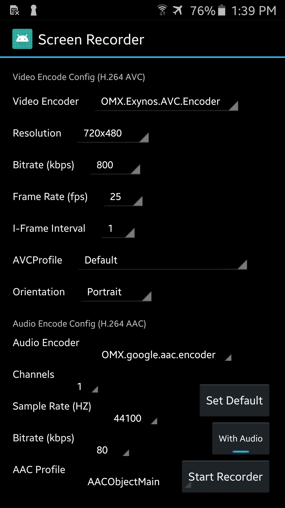

Screen Recorder 
=====
This is a DEMO APP that mainly implements the screen recording function (it can also record the sound from the microphone).



[][8] [Click here to download APK][7] Quick prevew of project functions

Note: It uses APIs such as [MediaProjectionManager][1], [VirtualDisplay][2], [AudioRecord][3], [MediaCodec][4] and [MediaMuxer][5], so this project supports at least Android 5.0.

Screen Recording Principles
=====

### Audio Sources

- **Mic**: Record from microphone as before.
- **System (Internal)**: Record device playback (Android 10+ only).
- **Mic + System**: (Future) Record both--not yet implemented.

### Command Line

You can launch recording via CLI (requires CLI activity):
```
adb shell am start -n net.yrom.screenrecorder/.CliActivity --es audioSource internal --es output /sdcard/demo.mp4
```


** Note ** You can checkout [32c005412](https://github.com/yrom/ScreenRecorder/tree/32c00541299e6ff56763e8f2254983008f03b24a) to view the original code (excluding microphone recording)
- `Display` can be "projected" to a `VirtualDisplay`
- Create a `VirtualDisplay` through a `MediaProjection` obtained from `MediaProjectionManager`
- `VirtualDisplay` will render the image to a `Surface`, which is created by `MediaCodec`

```
mEncoder = MediaCodec.createEncoderByType(MIME_TYPE);
...
mSurface = mEncoder.createInputSurface();
...
mVirtualDisplay = mMediaProjection.createVirtualDisplay(name, mWidth, mHeight, mDpi, DisplayManager.VIRTUAL_DISPLAY_FLAG_PUBLIC, mSurface, null, null);
```

- `MediaMuxer` encapsulates the image metadata obtained from `MediaCodec` and outputs it to the MP4 file

```
int index = mEncoder.dequeueOutputBuffer(mBufferInfo, TIMEOUT_US);
...
ByteBuffer encodedData = mEncoder.getOutputBuffer(index);
...
mMuxer.writeSampleData(mVideoTrackIndex, encodedData, mBufferInfo);
```
So in fact, on **Android 4.4**, you can create `VirtualDisplay` through `DisplayManager` and also record the screen, but because of permission restrictions, **ROOT** is required. (see [DisplayManager.createVirtualDisplay()][6])

[1]: https://developer.android.com/reference/android/media/projection/MediaProjectionManager.html
[2]: https://developer.android.com/reference/android/hardware/display/VirtualDisplay.html
[3]: https://developer.android.com/reference/android/media/AudioRecord.html
[4]: https://developer.android.com/reference/android/media/MediaCodec.html
[5]: https://developer.android.com/reference/android/media/MediaMuxer.html
[6]: https://developer.android.com/reference/android/hardware/display/DisplayManager.html
[7]: https://github.com/yrom/ScreenRecorder/releases/latest
[8]: https://play.google.com/store/apps/details?id=net.yrom.screenrecorder.demo
